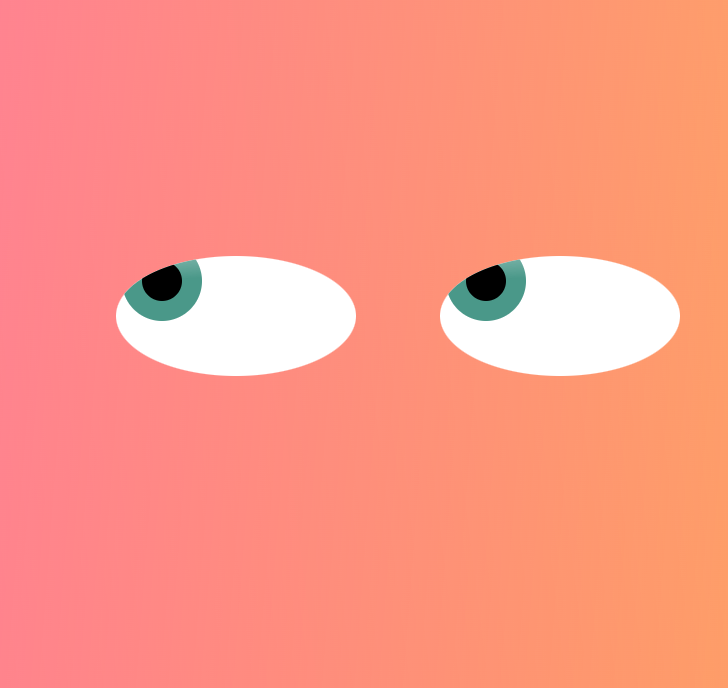

# Eyes

## Exercise on eyes

This is a super fun little exercise where you build divs inside divs to create eyes that follow your cursor as it moves across the page. We got the starter code that included one eye and then we had to add a second to make a pair. 

## Roadmap

I would love to add a littl toggle up top to change from one eye to two and vice versa

## Support
If you have any questions or concerns, shoot me an email at adriana.go1105@gmail.com

## License
This is an open source project, most of the code was provided by MIT Coding Program

#### Here are my socials:

<a href="https://github.com/adrigalle">
    
<a href="https://www.linkedin.com/in/adriana-gallegos-a2a992159">
       

